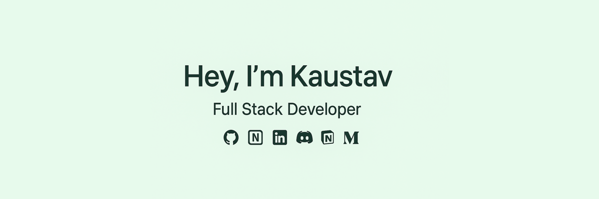

<!-- [](https://github.com/Akshay090/svg-banners) -->

<!-- My name is Kaustav Gupta. I'm a undergraduate from 🇮🇳  -->

My name is Kaustav Gupta. I'm a undergraduate from 🇮🇳 


- 💻 Full Stack Dev in progress
- ✏️ JavaScript
- 📦 [Linux](https://www.linux.com/) / [vscode](https://code.visualstudio.com) / [brave](https://brave.com/)
- 🌱 Exploring new opportunities in tech!
- 💭 Ask me anything at [Twitter](https://x.com/kaustav_gupta23)!
- 📌 Most active on [kaustavxg](https://github.com/kaustavxg)

---


<picture>
  <source media="(prefers-color-scheme: dark)" srcset="https://raw.githubusercontent.com/kaustavxg/kaustavxg/output/github-snake-dark.svg" />
  <source media="(prefers-color-scheme: light)" srcset="https://raw.githubusercontent.com/kaustavxg/kaustavxg/output/github-snake.svg" />
  
</picture>

[](https://github.com/ashutosh00710/github-readme-activity-graph)


<h2 align="left">💻 Tech Stack</h2>

**Programming Languages**  
 
 
 
 


**Frontend**  
 
 
 

**Backend**  
 
 

**Databases & ORMs**  
 
 
 
  

**Cloud & DevOps**  
 
 


**Developer Tools**  
 
 
 
 
 
 
 
 
 
 
  

**Prototyping & Design**  
 
 
  


<h2 align="left">🌐 Connect with me</h2>

<p align="left">
  <a href="https://www.linkedin.com/in/kaustav-gupta23/" target="_blank">
    
  </a>
  <a href="https://x.com/kaustav_gupta23" target="_blank">
    
  </a>
</p>


------------
<h2 align="left">🔥 My Stats</h2>
<span>Tracking started on <b>12th June 2025</b> — stats below are from that date to today.</span>
<!--START_SECTION:waka-->

```txt
Total Time: 251 hrs 22 mins

JavaScript    175 hrs 16 mins ⣿⣿⣿⣿⣿⣿⣿⣿⣿⣿⣿⣿⣿⣿⣿⣿⣿⣦⣀⣀⣀⣀⣀⣀⣀   69.73 %
C++           27 hrs 3 mins   ⣿⣿⣶⣀⣀⣀⣀⣀⣀⣀⣀⣀⣀⣀⣀⣀⣀⣀⣀⣀⣀⣀⣀⣀⣀   10.76 %
HTML          26 hrs 29 mins  ⣿⣿⣶⣀⣀⣀⣀⣀⣀⣀⣀⣀⣀⣀⣀⣀⣀⣀⣀⣀⣀⣀⣀⣀⣀   10.54 %
CSS           8 hrs 55 mins   ⣷⣀⣀⣀⣀⣀⣀⣀⣀⣀⣀⣀⣀⣀⣀⣀⣀⣀⣀⣀⣀⣀⣀⣀⣀   03.55 %
Markdown      5 hrs 5 mins    ⣦⣀⣀⣀⣀⣀⣀⣀⣀⣀⣀⣀⣀⣀⣀⣀⣀⣀⣀⣀⣀⣀⣀⣀⣀   02.02 %
```

<!--END_SECTION:waka-->

<!--START_SECTION:workflows-update-->

<p align="center">
      This <i>README</i> file is refreshed <b>every 24 hours</b>!<br/>
      <!-- Last refresh: <b>Jun 12, 2025, 7:53 AM IST</b><br/> -->
      </b>
      Made with ❤️ by Kaustav Gupta
    </p>

<!--END_SECTION:workflows-update-->
